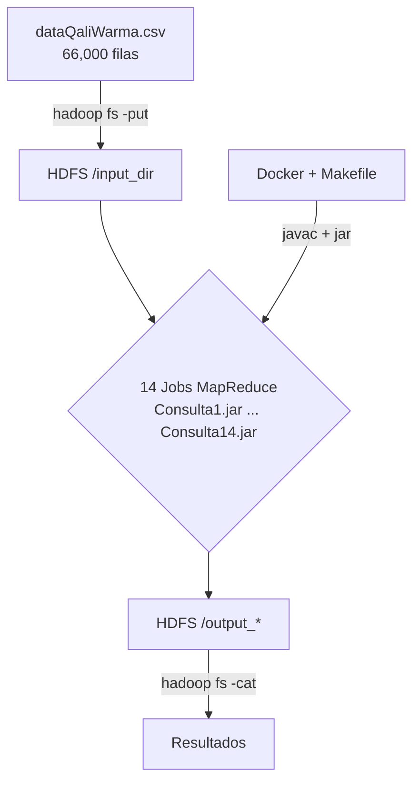
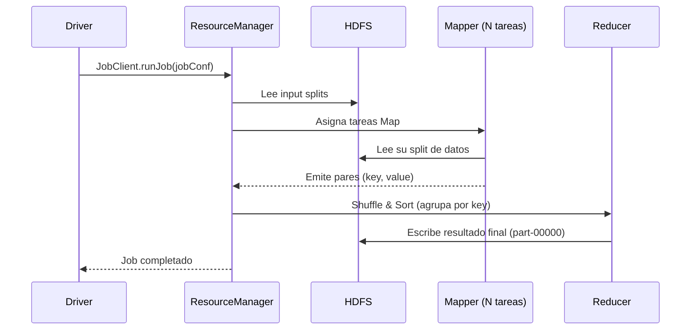
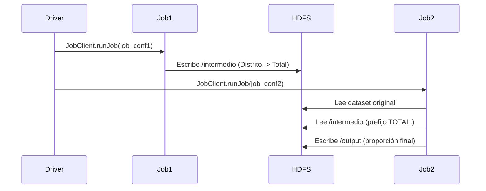
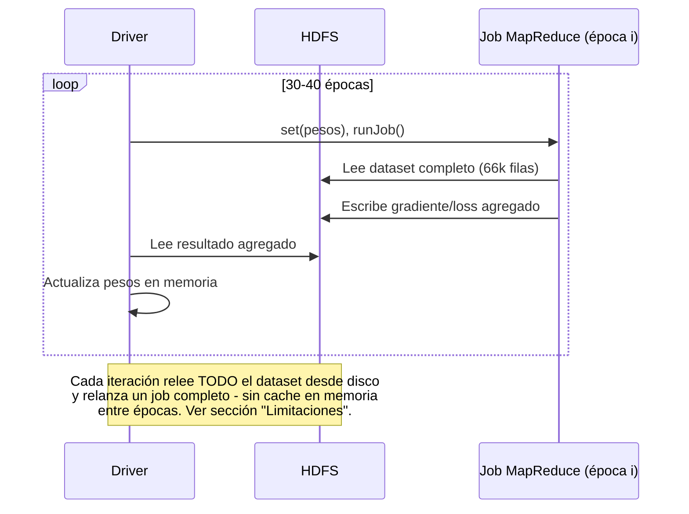

# **Pipeline de Analítica MapReduce: Programa Qali Warma**


[]()
[]()
[]()


## El dataset

Fuente: Plataforma Nacional de Datos Abiertos del Perú (PNDA)
*Programa Nacional de Alimentación Escolar Qali Warma, IIEE 2023*.
Publicado 30/09/2023 (el más reciente disponible al momento del proyecto).
~66,000 filas, 18 columnas, separador `;`, cobertura nacional (25 regiones).

| Índice | Columna | Descripción |
|---|---|---|
| 0 | `FechaActualizacion` | Fecha de última actualización del registro |
| 1 | `Departamento` | Departamento del Perú (25 valores posibles) |
| 2 | `Provincia` | Provincia dentro del departamento |
| 3 | `Distrito` | Distrito dentro de la provincia |
| 4 | `Ubigeo` | Código INEI de ubicación geográfica |
| 5 | `CentroPoblado` | Centro poblado donde se ubica la IIEE |
| 6 | `UnidadTerritorial` | Unidad territorial de gestión de Qali Warma |
| 7 | `CodigoIIEEQW` | Código interno de Qali Warma para la institución educativa (IIEE) |
| 8 | `CodigoModularIIEE` | Código modular oficial de la IIEE (Minedu) |
| 9 | `CodigoAnexoIIEE` | Código de anexo, si la IIEE tiene sub-sedes |
| 10 | `InstitucionEducativa` | Nombre de la institución educativa |
| 11 | `NivelEducativo` | Nivel educativo (Inicial, Primaria, Secundaria) |
| 12 | `CodigoLocalMinedu` | Código de local escolar del Minedu (puede venir vacío) |
| 13 | `DireccionIIEE` | Dirección física de la IIEE |
| 14 | `NroUsuarios` | Número de beneficiarios (niños atendidos) - **campo numérico principal** |
| 15 | `ComiteCompra` | Comité de compra asignado |
| 16 | `Item` | Ítem/categoría de distribución |
| 17 | `ModalidadAtencion` | Modalidad de atención: `RACIONES` o `PRODUCTOS` |

## Arquitectura general



### Ejecución de un job MapReduce simple (diagrama de secuencia)



### MapReduce encadenado con join (Consultas 9 y 10)



### Loop de descenso de gradiente (Consultas 11-14) - y por qué es costoso



## Las 14 consultas

| # | Grupo | Pregunta |
|---|---|---|
| 1 | Agregación multi-campo | Total de `NroUsuarios` por Departamento + Nivel Educativo |
| 2 | Agregación multi-campo | Conteo de IIEE por Provincia + Modalidad de Atención |
| 3 | Agregación multi-campo | Total de `NroUsuarios` por Unidad Territorial + Item |
| 4 | Agregación multi-campo | Conteo de IIEE por Distrito + Nivel Educativo |
| 5 | Agregación multi-campo | Total de `NroUsuarios` por Comité de Compra + Modalidad |
| 6 | Estadística descriptiva | Promedio, mediana y desviación estándar de `NroUsuarios` por Departamento |
| 7 | Búsqueda de texto | Registros que contienen el subtexto "SANTA" en 3 campos de texto a la vez |
| 8 | Extremos agrupados | IIEE con mayor y menor `NroUsuarios` por Departamento |
| 9 | MapReduce encadenado | Proporción de `NroUsuarios` de cada IIEE sobre el total de su Distrito |
| 10 | MapReduce encadenado | Proporción de `NroUsuarios` de cada IIEE sobre el total de su Unidad Territorial |
| 11 | Clasificación (ML) | ¿Se puede predecir la Modalidad de Atención (RACIONES/PRODUCTOS)? |
| 12 | Clasificación (ML) | ¿Se puede predecir si el Nivel Educativo es INICIAL? |
| 13 | Regresión (ML) | Predecir `NroUsuarios` a partir de 3 features |
| 14 | Regresión (ML) | Predecir `NroUsuarios` a partir de 1 sola feature (comparación) |

## Resultados clave

**Clasificación (Grupo 6)** - 30 épocas, sigmoide + cross-entropy implementados a mano:

| Consulta | Target | Loss final | Accuracy final |
|---|---|---|---|
| Q11 | Modalidad de atención | 0.6607 | 61.3% |
| Q12 | Nivel educativo INICIAL | 0.6730 | 58.0% |

**Regresión (Grupo 7)** - 40 épocas, modelo lineal + MSE:

| Consulta | Features | RMSE final (escala real) |
|---|---|---|
| Q13 | 3 features | 129.1 estudiantes |
| Q14 | 1 feature (solo región) | 133.0 estudiantes |

Resultados modestos pero reales - y una conclusión deliberadamente honesta:
la región por sí sola captura la mayor parte de la varianza explicable;
agregar dos features más mejora el RMSE solo un ~3%. Documentar *por qué*
un modelo rinde de forma modesta es una señal de portafolio tan valiosa
como reportar un score alto.

## Stack técnico

`Hadoop 2.8.0 (API legacy mapred)` · `Java 8` · `Docker` · `GNU Make` ·
`HDFS` · Descenso de gradiente por lotes (implementado a mano, sin
librerías de ML)

## Guía rápida (probado y funcionando de punta a punta)

### Paso 1 - Compilar los 14 jars

```bash
docker build -t qaliwarma-build .
docker run --rm -v "${PWD}/dist:/app/dist" qaliwarma-build
```

Esto genera `dist/Consulta1.jar` ... `dist/Consulta14.jar`, cada uno
autocontenido (solo trae las clases que su consulta necesita).

### Paso 2 - Levantar un cluster Hadoop 2.8.0 real (Docker)

```bash
cd cluster
make up          # construye la imagen del cluster y levanta HDFS + YARN
make load-data   # sube dataQaliWarma.csv a HDFS (una sola vez)
```

Interfaces web mientras el cluster está arriba:
- NameNode: http://localhost:50070
- ResourceManager (monitor de recursos): http://localhost:8088

### Paso 3 - Correr cualquier consulta con un solo comando

```bash
make run QUERY=1    # Grupos 1-4: agregación/estadística/búsqueda/extremos
make run QUERY=9    # Grupo 5: MapReduce encadenado
make run QUERY=11   # Grupos 6-7: entrenamiento iterativo (tarda más, ~30-40 jobs)
```

El resultado se imprime directo en la terminal. Ver la sección
[Las 14 consultas](#las-14-consultas) más abajo para saber qué hace cada
número antes de elegir cuál correr.

### Paso 4 - Apagar el cluster

```bash
make down
```


## Fuente de datos

Plataforma Nacional de Datos Abiertos del Perú (PNDA) - [*Programa Nacional
de Alimentación Escolar Qali Warma, IIEE 2023*. Publicado 2023-09-30.](https://www.datosabiertos.gob.pe/dataset/programa-nacional-de-alimentación-escolar-qali-warma-iiee-2023)

## Licencia

[MIT](./LICENSE)